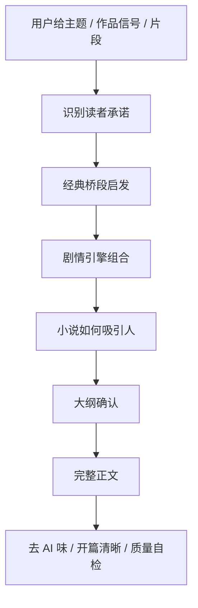

# qiaomu-novel-generator

> 你想写一个爽文、武侠、修仙、悬疑或现代组织内斗故事，AI 却常常给你一篇“像大纲、像说明书、像套路拼贴”的东西。
> `qiaomu-novel-generator` 先帮你把剧情钩子、经典桥段、人物欲望、冲突升级和结尾余味定住，再写成原创、完整、低 AI 味的中文小说。
>
> Turn a rough Chinese story idea into a selectable plot strategy, then into a complete gripping short story.

[](#安装)
[](https://github.com/joeseesun/qiaomu-novel-generator/stargazers)
[](https://github.com/joeseesun/qiaomu-novel-generator/forks)
[](https://github.com/joeseesun/qiaomu-novel-generator/issues)
[](https://github.com/joeseesun/qiaomu-novel-generator/commits/main)
[](LICENSE)

```bash
npx skills add joeseesun/qiaomu-novel-generator
```

**中文** | [English](#english)

## 为什么值得装

普通小说生成器经常直接开写。结果是：

- 开头没有钩子，读者翻两段就走。
- 主角没有欲望，只是在被剧情推着跑。
- 爽点来得太便宜，打脸不够爽。
- 想“参考某部作品”，最后变成危险的照搬。
- 想“学某位作者”，最后只学到表面腔调。
- 越改越像 AI：`不是X，而是Y`、总结腔、教学腔、黑话堆满。

这个 skill 的思路相反：**先讨论剧情怎么吸引人，再写正文。**

它会先把你的输入拆成可选择的剧情引擎：

```text
情绪承诺 -> 高压关系 -> 冲突场 -> 经典桥段重构 -> 升级节奏 -> 结尾余味
```

你可以回复 `按默认`、`更爽一点`、`更悬疑`、`1B 2A 3C`，它再进入正文写作。

## 真实输出预览

| 输入 | 输出 |
|---|---|
| 江湖悬疑、命运压力、交易与误判 | [《雨夜验剑》](examples/sample-01-wuxia-suspense.md) |
| 近未来科幻、记忆交易、身份反转 | [《第七枚记忆》](examples/sample-02-sci-fi-memory.md) |

你还可以让它先给剧情策略，而不是直接写：

```text
我想写一个类似《凡人修仙传》的小说。
```

它会先给你：

- 底层小人物的生存爽点
- 地下交易、杀人夺宝、宗门小比等可选桥段
- 主角欲望、隐藏压力和升级代价
- 可确认的大纲
- 确认后再写第一章或完整短篇

## 它最擅长什么

### 1. 把一句想法变成可追读剧情

你说：

```text
帮我生成一个小说。
```

它不会马上塞给你一篇泛泛的故事，而是先给紧凑选项：

```text
1. 主情绪：A 逆袭爽 / B 悬疑惊 / C 黑色反转
2. 高压关系：A 外来者/上位者 / B 仇人/合作者 / C 救命恩人/错认者
3. 冲突场：A 公开审查 / B 地下拍卖 / C 家宴质证
```

### 2. 把经典桥段拆成“功能”，再重构

你说：

```text
用《食神》那种跌落神坛再公开翻身的结构，换成修仙故事。
```

它会借“失势、底层重学、公开回归”的结构，不复制人物、台词、场面和情节链。

可用的桥段卡包括：

- 跌落神坛再翻身
- 地下拍卖/鉴宝反转
- 法庭/公开质证翻案
- 隐藏身份与迟来承认
- 后台项目视角与组织讽刺
- 宗门试炼、规则漏洞、公开打脸

### 3. 搜索后重构，而不是复述原作

你说：

```text
先联网搜一下这本书，再改成大厂内斗爽文。
```

它会先提取公开资料里的稳定事实、读者爽点、叙事功能和不可复制边界，再给你桥段组合。

它不把原作角色、名场面、签名句、世界观设定或连续情节链搬进新故事。

### 4. 写之前先定大纲

适合你想认真写一个故事的时候：

```text
我想写一个类似冰与火之歌的现代职场剧情，我们先讨论下。
```

它会先输出：

- 经典桥段启发
- 小说如何吸引人
- 主角欲望
- 隐藏压力
- 冲突升级
- 章节/场景钩子
- 结尾余味
- 大纲

确认后再写正文。

### 5. 专门处理“AI 味”

内置反 AI 味检查：

- 避免 `不是X，而是Y`
- 避免 `关键在于`、`值得注意的是`
- 避免总结式结尾
- 避免装饰性破折号
- 避免开篇为了诗性而误导题材

例如它会把：

```text
死人走进了酒肆。
```

改成更清楚的危险画面：

```text
一个快死的人走进了酒肆，胸口的血已经在狐裘上结成冰。
```

## 安装

一行安装：

```bash
npx skills add joeseesun/qiaomu-novel-generator
```

确认能被发现：

```bash
npx skills add joeseesun/qiaomu-novel-generator --list
```

确认本地已安装：

```bash
test -f .agents/skills/qiaomu-novel-generator/SKILL.md || test -f ~/.agents/skills/qiaomu-novel-generator/SKILL.md
```

## 前置条件

- [ ] 已安装 Node.js：运行 `node -v` 检查；没有的话可从 https://nodejs.org 安装。
- [ ] 已安装 npm/npx：运行 `npx --version` 检查；Node.js 通常会自带。
- [ ] 使用支持 agent skills 的工具，例如 Codex、Claude Code 或其他兼容本地 skills 的 Agent。
- [ ] 如果要让它联网研究参考作品，当前 Agent 环境需要允许浏览或搜索。

## 你可以这样说

```text
用 qiaomu-novel-generator，写一个不会武功的书生误入江湖死局的完整短篇。
```

```text
帮我生成一个小说，先给几个方向让我选。
```

```text
我想写一个类似《凡人修仙传》的小说，先给爽点和大纲。
```

```text
给我几个著名电影、电视剧、小说的经典桥段选择，组合成一个新故事。
```

```text
先联网搜一下《太白金星有点烦》的公开资料，再改成现代组织内斗爽文。
```

```text
这个开篇有点误导，我以为是鬼怪，保留钩子但写清楚发生了什么。
```

```text
这段 AI 味太重，尤其是“不是……而是……”，帮我改得像人写的。
```

## 工作流



## 内置剧情引擎

| 类型 | 适合制造什么爽感 |
|---|---|
| 隐藏身份 | 被低估后公开翻盘 |
| 地下拍卖/鉴宝 | 废物变宝、价值误判、反向打脸 |
| 宗门试炼/公开审查 | 规则漏洞、见证人反应、资历压制反杀 |
| 杀人夺宝/禁忌交易 | 机缘带来危险，危险逼出成长 |
| 双强博弈 | 互相试探、互相利用、反败为胜 |
| 组织内斗 | 抢功、甩锅、文件证据、公开复盘 |
| 悬疑线索链 | 每个答案打开更坏的问题 |
| 追妻/错认/迟来承认 | 情绪拉扯、尊严、代价选择 |

## 质量门槛

每篇故事都会按这些维度自检：

- 开篇钩子：前三段有危险、羞辱、损失或谜题。
- 人物欲望：主角马上想要一个看得见的东西。
- 冲突升级：至少三次变难，不靠流水账。
- 对白张力：对白里有威胁、试探、隐瞒或交换。
- 画面感：用物件、动作、场景承载信息。
- 反转/悬念：前文细节在后文换意义。
- 结尾余味：解决当下问题，同时留下回响。
- 去 AI 味：删掉公式化对比和总结腔。
- 开篇语义清晰：钩子不能让读者误判题材或基本事实。

## 安全边界

这个 skill 支持“借鉴结构”，不支持“复制作品”。

允许：

- 借悬念、留白、命运压力、类型爽点、结构反转。
- 把经典桥段拆成通用功能再组合。
- 把作者/作品信号翻译成可泛化技法。

不做：

- 不复制受版权保护文本。
- 不搬运名场面、角色、地名、招式、签名句。
- 不复刻可识别的连续情节链。
- 不直接仿写在世作者的独特个人文风。

## 开发与验证

```bash
cd ~/.agents/skills/qiaomu-novel-generator
python3 scripts/validate_skill.py
python3 /Users/joe/.codex/skills/.system/skill-creator/scripts/quick_validate.py .
python3 scripts/evaluate_story.py examples/sample-01-wuxia-suspense.md --fail-on-warning
python3 scripts/evaluate_story.py examples/sample-02-sci-fi-memory.md --fail-on-warning
```

包结构：

```text
SKILL.md
README.md
manifest.json
agents/interface.yaml
agents/openai.yaml
references/
examples/
scripts/
assets/qiaomu-profile/
```

## Troubleshooting

| 问题 | 常见原因 | 处理方式 |
|---|---|---|
| `npx skills add` 找不到 skill | GitHub repo 未更新、`SKILL.md` frontmatter 无效，或当前目录安装路径不对 | 先运行 `npx skills add joeseesun/qiaomu-novel-generator --list` |
| 已安装但没有自动触发 | 当前 Agent 不支持隐式调用，或输入没有命中小说/故事触发词 | 明确说“用 qiaomu-novel-generator 写……” |
| 故事变成设定说明 | 输入没有主角欲望、代价或危险 | 补一句“主角想要什么、会失去什么、谁在阻止他” |
| 还没想清楚剧情 | 只有题材，没有冲突和结尾味道 | 让 skill 先给选项，回复 `按默认` 或 `1B 2A 3C` |
| 套路太少 | 一直在同一题材里打转 | 要求“换一组剧情引擎”，例如悬疑惊、组织逆袭、黑色反转 |
| 想借经典剧情 | 容易变成照搬 | 先让 skill 给“经典桥段启发”，选 2-3 个功能组合后再重构 |
| 想先搜某部作品 | 容易复述原作 | 用 `source-research-remix` 只抽象功能、读者爽点和不可复制边界 |
| 开篇看不懂 | 为了钩子使用了误导题材的隐喻 | 要求“开篇误读修复”，补上同句或下一句的现实锚点 |
| AI 味重 | 公式化对比、教学腔、总结腔 | 要求“去 AI 味”，优先删改“不是X，而是Y” |

<!-- qiaomu-profile:start -->
## 关于向阳乔木

向阳乔木（乔向阳 / Joe）是一位实践型 AI 产品与内容创作者，长期把前沿 AI 变化转译成可复用的工作流、产品判断、AI 编程实践、AI 搜索实践和 GEO/AI 营销方法。

- 个人网站: https://qiaomu.ai
- 博客: https://blog.qiaomu.ai
- X: https://x.com/vista8
- GitHub: https://github.com/joeseesun/
- 微信公众号: 向阳乔木推荐看

### 支持与关注

| 打赏支持 | 微信公众号 |
|---|---|
|  |  |
| 感谢支持乔木持续分享 AI 实践 | 扫码关注「向阳乔木推荐看」 |

<!-- qiaomu-profile:end -->

## License

MIT. See [LICENSE](LICENSE).

---

<a name="english"></a>

## English

`qiaomu-novel-generator` is an agent skill for writing original Chinese short fiction from a theme, character setup, trope, classic-story signal, or draft excerpt.

It does not jump straight into generic prose. It first turns the idea into a story strategy: reader promise, pressure relationship, conflict arena, plot engines, outline, and ending aftertaste. Then it drafts the story and checks for hook strength, desire, escalation, dialogue pressure, scene imagery, reversal, ending resonance, anti-AI phrasing, and opening clarity.

Install:

```bash
npx skills add joeseesun/qiaomu-novel-generator
```

Try:

```text
Use qiaomu-novel-generator to write a complete wuxia suspense short story.
```

```text
I want a story inspired by cultivation web novels. Give me the plot strategy first.
```

```text
Search public references for this novel, extract the reusable craft functions, then remix them into a modern workplace power-struggle story.
```

Core features:

- option-based prewrite flow before drafting
- classic beat remix without copying protected works
- genre engines for wuxia, cultivation, suspense, romance, workplace, sci-fi, and short-drama-style hooks
- anti-AI-language gate
- opening-clarity gate to avoid misleading poetic hooks
- sample evaluation scripts

This skill does not copy protected text, famous scenes, signature lines, unique characters, or recognizable plot chains, and it does not directly imitate a living author's distinctive style.
